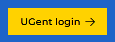
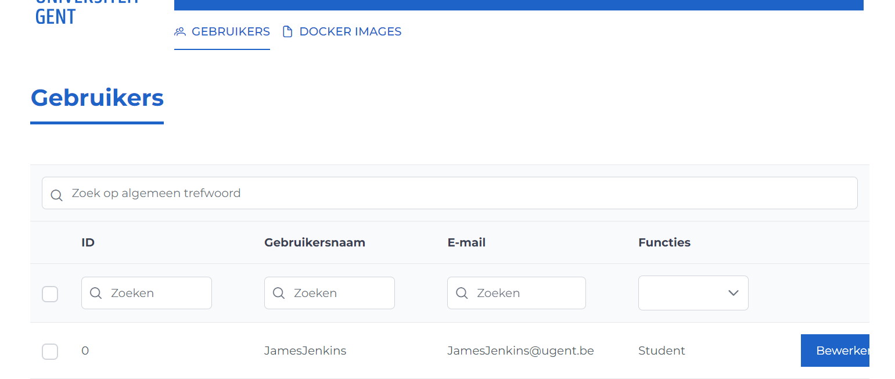
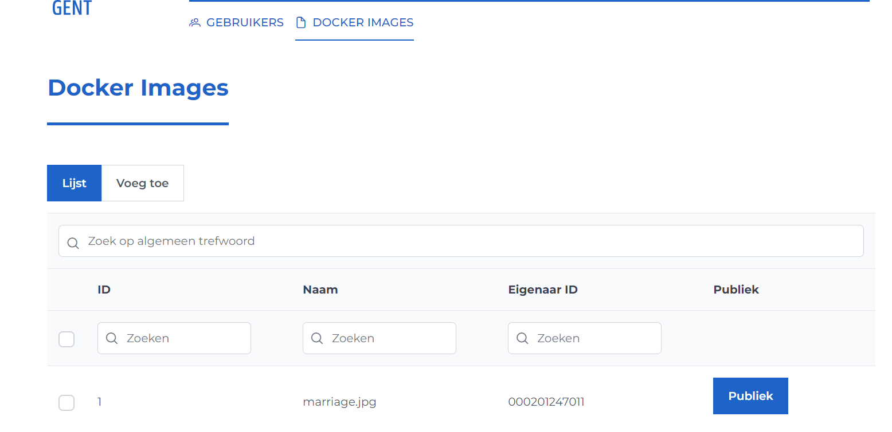

# Admin Help Page

This page describes how to interact with Ypovoli as a admin.

## Login/Logout

**Login**

- On the login page, there is a button with the text "UGent login".

- Click on this button. You will be redirected to the UGent login page.
- Select the desired account and follow the login steps. You will be redirected to the dashboard.

:::info
To further navigate to the admin pannel you can add "/admin".
:::

**Logout**

- Click on your name in the navigation bar.

## Change Language

- Click on the arrow next to EN at the top of the navigation bar and select the desired language.

## Adjusting User Roles
- Click on "Users" in the navigation bar.
- Click on "Edit" next to the chosen user.
- Adjust the roles and save via the "Save" button.

## Viewing and Managing Docker Images
- Click on "Docker images" in the navigation bar.

::: info
Adjust the status (Private or Public) via the button in the "Public" column.
:::

::: info
Add a new image via the "Add" button.
:::
