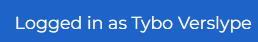

# Assistant Help Page

This page describes how to interact with Ypovoli as a assistant.

## Login/Logout

**Login**

- On the login page, there is a button with the text "UGent login".

- Click on this button. You will be redirected to the UGent login page.
- Select the desired account and follow the login steps. You will be redirected to the dashboard.

**Logout**

- Click on your name in the navigation bar.

## Change Language

- Click on the arrow next to EN at the top of the navigation bar and select the desired language.

## Change Mode

::: danger Caution!
- Only possible if the user has multiple roles like student, teacher, assistant, or admin.
:::

- Click on the arrow next to the currently selected role at the top of the navigation bar.
- Choose the new role with which you want to view the page.

