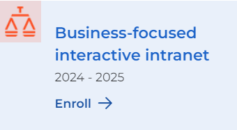
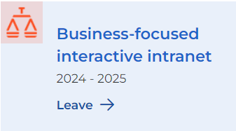
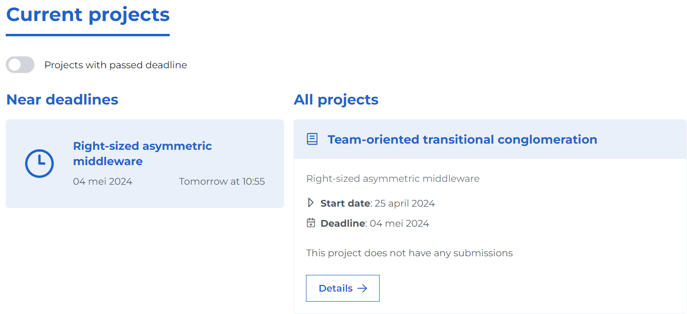
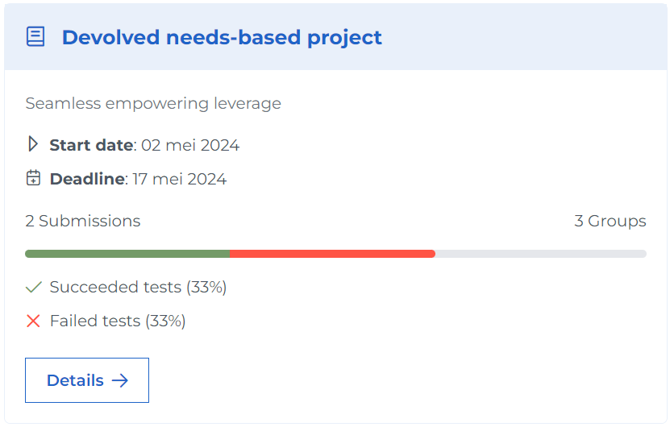
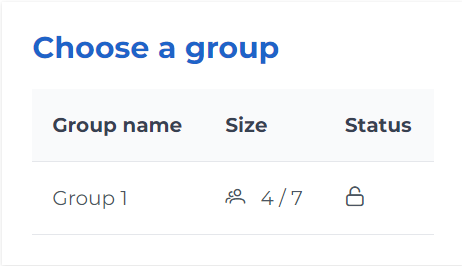
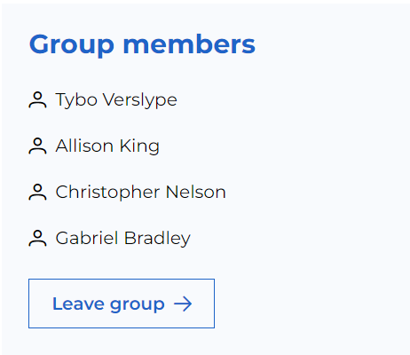

# Student Help Page

This page describes how to interact with Ypovoli as a student.

## Login/Logout

**Login**

- On the login page, there is a button with the text "UGent login".

- Click on this button. You will be redirected to the UGent login page.
- Select the desired account and follow the login steps. You will be redirected to the dashboard.

**Logout**

- Click on your name in the navigation bar.

## Change Language

- Click on the arrow next to EN at the top of the navigation bar and select the desired language.

## Change Mode

::: danger Caution!
- Only possible if the user has multiple roles like student, teacher, assistant, or admin.
:::

- Click on the arrow next to the currently selected role at the top of the navigation bar.
- Choose the new role with which you want to view the page.

## Enroll in/Leave Course

    
    

**Enroll**

- Click on "Courses" in the navigation bar.
- Find the correct course using the filters on the left side of the page.
- Click on the enroll button next to the correct course.
- You are successfully enrolled in this course.

**Leave**
- Option 1:
  - Click on "Courses" in the navigation bar.
  - Find the correct course using the filters on the left side of the page.
  - Click on the "Leave" button next to the correct course.
  - You have successfully left this course.
- Option 2:
  - Go to the detail page (see [Course Details](#course-details)).
  - Click on the leave button at the bottom.
  - A popup appears.
  - Confirm by clicking the leave button.

## Course Details
- Click on "Dashboard" in the navigation bar.
- Scroll down to the "My Courses" section.
- Click on the details button next to the chosen course.

::: tip
- If you want to view a course from a previous academic year, select the correct year in the academic year selector.
:::

## View Projects

- Option 1:
  - Click on "Dashboard" in the navigation bar.
  - At the top of the page, there is a section "Current Projects".
  ::: info
  - On the left, all projects with a deadline within 7 days are displayed. On the right side, there is an overview of all the projects.
  - With the toggle button at the top, you can view projects with an expired deadline.
  :::
- Option 2:
  - Click on "Calendar" in the navigation bar.
  - On the left, you see a calendar where a red circle indicates the number of deadlines on a given day.
  - Select a day with projects and click on the desired project.
- Option 3:
  - Click on "Dashboard" in the navigation bar.
  - Scroll to the "My Courses" section.
  - Click on the course of the desired project.
  - Under the "Current Projects" section, you will see all projects for this specific course.
- Option 4:
  - Click on "Projects" in the navigation bar.
  - You will see an overview of all your projects.

::: info Project card explanation

- The card is divided as follows:
  - Name of the corresponding course.
  - Short description of this course.
  - Start date and deadline of the project.
  - Bar with the progress of all students, including the number of submissions and the number of groups.
  - Status of the performed tests for these submissions.
:::

## Find Teachers of a Course

- Go to the detail page of the course (see [Course Details](#course-details)).
- Scroll to the section "People linked to this course".
- Here you will find a list of the users linked to this course.

## Join/Leave Group

  **Join**

  
- Go to the detail page for the chosen project.
- Click on the chosen group and click on "Choose group".
- You are successfully enrolled in this group.

**Leave**
  
- Go to the project detail page.
- Click on leave group.

## Submit Assignment
- Go to project detail page.
- Click on "Submit".
- Add files with the "Choose a file" button.
- Make a submission with the "Upload" button.

## View Previous Submissions Status
- Go to the submission page.
- It says there. !!! TODO !!!
