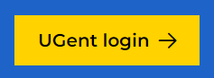
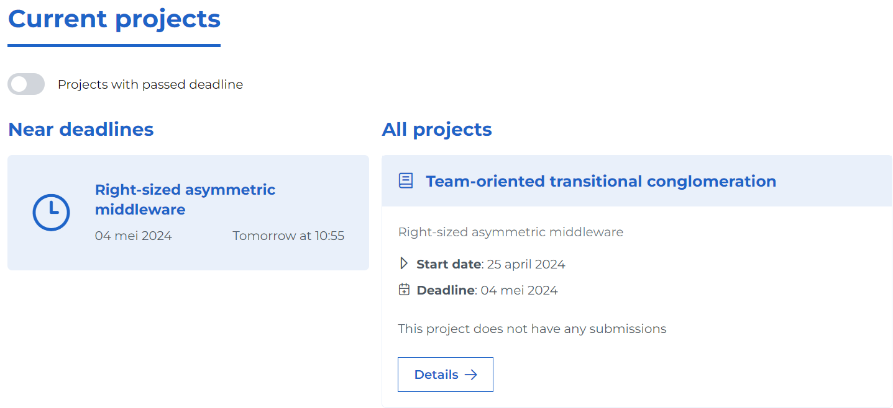
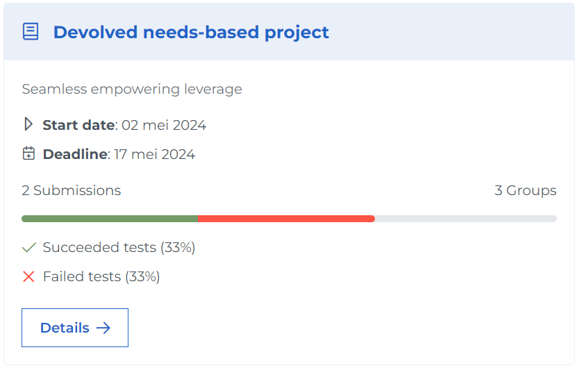

# Teacher Help Page

This page describes how to interact with Ypovoli as a teacher.

## Login/Logout

**Login**

- On the login page, there is a button with the text "UGent login".

- Click on this button. You will be redirected to the UGent login page.
- Select the desired account and follow the login steps. You will be redirected to the dashboard.

**Logout**

- Click on your name in the navigation bar.

## Change Language

- Click on the arrow next to EN at the top of the navigation bar and select the desired language.

## Change Mode

::: danger Caution!
- Only possible if the user has multiple roles like student, teacher, assistant, or admin.
:::

- Click on the arrow next to the currently selected role at the top of the navigation bar.
- Choose the new role with which you want to view the page.

## Creating a Course
- Click on Dashboard in the navigation bar.
- Scroll down to the "My Courses" section.
- Click on the + button.

:::info
If you only want to make your course available via an invitation link, you can do so via this button.

:::danger
- Activate this link via the share button. (maximum validity is 28 days)

    

:::

## Course Details
- Click on Dashboard in the navigation bar.
- Scroll down to the "My Courses" section.
- Click on the details button next to the desired course.

::: tip
- If you want to view a course from a previous academic year, select the correct year in the academic year selector.
:::

## Creating a Project

- Option 1:
    - Click on Dashboard in the navigation bar.
    - Click on "Create new project".
- Option 2:
    - Click on Calendar in the navigation bar.
    - Click on "Create new project".
- Option 3:
    - Go to the detail page of a course (see [Course Details](#course-details)).
    - Scroll to "Current Projects".
    - Click on the + button.

## Viewing Projects

- Option 1:
  - Click on Dashboard in the navigation bar.
  - At the top of the page, there is a "Current Projects" section.
  ::: info
  - Here are all the projects with a deadline within the next 7 days on the left and all projects on the right.
  - Use the toggle button at the top to view projects with expired deadlines.
  :::
- Option 2:
  - Click on Calendar in the navigation bar.
  - On the calendar, an indication of the number of deadlines on a specific day is given using a red circle.
  - Select a day with projects and click on the desired project.
- Option 3:
  - Click on Dashboard in the navigation bar.
  - Scroll to the "My Courses" section.
  - Click on the course of the desired project.
  - Under the "Current Projects" section, you will see all projects for this specific course.
- Option 4:
  - Click on Projects in the navigation bar.
  - You will see an overview of all your projects.

::: info Project Card Explanation
<!-- TODO maybe add a photo and indicate with numbers -->

The card is divided as follows:
- Name of the associated course.
- Brief description of this course.
- Start date and deadline of the project.
- Progress bar of all students, including the number of submissions and the number of groups.
- Status of the tests performed for these submissions.
:::

## Searching for and Editing Course Instructors
- Go to the detail page of the course (see [Course Details](#course-details)).
- Scroll to the "Instructors Linked to This Course" section.
- Here you will find a list of the instructors for this course.

::: info
- Via the edit button, you can add (or remove) instructors to this course.
- Via the trash can icon, you can remove instructors from this course. (only if there is more than one remaining instructor)
:::
