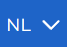
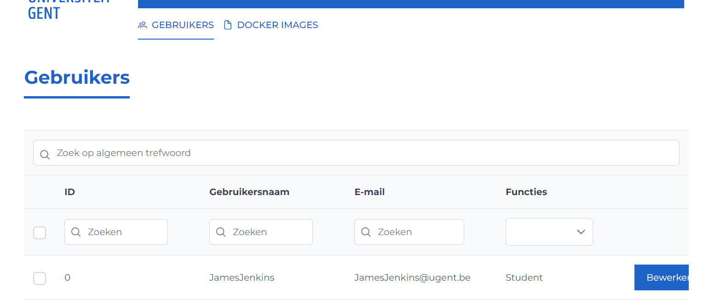

# Admin help pagina

Deze pagina beschrijft hoe u als administrator met Ypovoli interageert.

## Login/Logout

**Login**

- Op de login pagina staat een knop met tekst UGent login.

- Druk op deze knop. U wordt doorverwezen naar de UGent inlogpagina.
- Selecteer het gewenste account en volg de login stappen. U wordt doorverwezen naar het dashboard.

:::info
Om verder te navigeren naar het admin paneel kan u dit via "/admin".
:::

**Logout**

- Druk op uw naam in de navigatiebalk.

## Taal veranderen

- Druk bovenaan in de navigatiebalk op het pijltje naast NL en selecteer de gewenste taal.

## Rollen van gebruiker aanpassen
- Druk in de navigatiebalk op "Gebruikers".
- Druk op bewerken bij de gekozen gebruiker.
- Pas de rollen aan en sla op via de knop "Sla op".

## Docker images bekijken en beheren
- Druk in de navigatiebalk op "Docker images".

::: info
Pas de status (Privé of Publiek) aan via de knop in de kolom "Publiek".
:::

::: info
Voeg een nieuwe image toe via de knop "Voeg toe".
:::