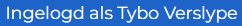

# Student help pagina

Deze pagina beschrijft hoe u als student met Ypovoli interageert.

## Login/Logout

**Login**

- Op de login pagina staat een knop met tekst UGent login.

- Druk op deze knop. U wordt doorverwezen naar de UGent inlogpagina.
- Selecteer het gewenste account en volg de login stappen. U wordt doorverwezen naar het dashboard.

**Logout**

- Druk op uw naam in de navigatiebalk.

## Taal veranderen

- Druk bovenaan in de navigatiebalk op het pijltje naast NL en selecteer de gewenste taal.

## Modus veranderen

::: danger Opgepast!
- Aleen mogelijk indien gebruiker meerdere van de volgende rollen heeft: student, assistent, prof of admin.
:::

- Druk in de navigatiebalk bovenaan op het pijltje naast de momenteel geselecteerde rol.
- Kies de niewe rol waarmee u de pagina wil bekijken.

## In/uitschrijven voor vak

    
    

**Inschrijven**

- Druk in de navigatiebalk op "Vakken".
- Zoek het correcte vak via de filters links op de pagina.
- Klik op de inschrijven knop bij het correcte vak.
- U bent succesvol ingeschreven voor dit vak.

**Uitschrijven**
- Optie 1:
  - Druk in de navigatiebalk op "Vakken".
  - Zoek het correcte vak via de filters links op de pagina.
  - Klik op de uitschrijven knop bij het correcte vak.
  - U bent succesvol uitgeschreven voor dit vak. 
- Optie 2:
  - Ga naar de detail pagina van het vak (zie [Vak details](#vak-details)).
  - Klik onderaan op de knop uitschrijven.
  - Er verschijnt een pop up.
  - Bevestig met de knop uitschrijven.

## Vak details
- Druk in de navigatiebalk op Dashboard.
- Scrol naar de sectie "Mijn vakken".
- Klik op de details knop bij het gekozen vak.

::: tip
- Indien u een vak van een vorig academiejaar wil bekijken, selecteer het correcte jaar in de academiejaar selector.
:::

## Projecten bekijken

- Optie 1:
  - Druk in de naviegatiebalk op Dashboard.
  - Bovenaan de pagina staat een sectie "Lopende projecten".
  ::: info
  - Hier staan links alle projecten met een deadline binnen de 7 dagen en rechts alle projecten.
  - Met de schakelknop bovenaan is er de mogelijkheid om projecten met een verstreken deadline te bekijken.
  :::
- Optie 2:
  - Druk in de navigatiebalk op "Kalender".
  - Op de kalender wordt, met behulp van een rode cirkel, een indicatie gegeven van het aantal deadlines op een bepaalde dag. 
  - Selecteer een dag met projecten en klik op het gewenste project.
- Optie 3:
  - Druk in de navigatiebalk op "Dashboard".
  - Scrol naar de sectie "Mijn vakken".
  - Druk hier op het vak van het gezochte project.
  - Onder de sectie "Lopende projecten" ziet u alle projecten voor dit specifieke vak.
- Optie 4: 
  - Druk in de navigatiebalk op "Projecten".
  - U ziet een overzicht van al uw projecten.

::: info Project kaart uitleg
<!-- TODO maybey ne fotoke en me numerkes aanduide -->

De kaart is als volgt ingedeeld:
- Naam van het bijhorende vak.
- Korte beschrijving van dit vak.
- Startdatum en deadline van het project.
- Balk met de voortgang van alle studenten, met hierbij het aantal indieningen en het aantal groepen.
- Status van de uitgevoerde testen voor deze indieningen.
:::

## Lesgevers van een vak opzoeken
- Ga naar de detail pagina van het vak (zie [Vak details](#vak-details)).
- Scrol naar de sectie "Lesgevers gelinkt aan dit vak".
- Hier vindt u een lijst van de lesgevers voor dit vak.

## Groep in/uitschrijven

  **Inschrijven**

  
- Ga naar de detail pagina voor het gekozen project.
- Druk op de gekozen groep en klik op "Kies groep".
- U bent succesvol ingeschreven in deze groep.

**Uitschrijven**
  
- Ga naar de detail pagina van het project.
- Druk op "Verlaat groep".

## Indiening maken
- Ga naar de detail pagina van het project.
- Druk op "Indienen".
- Voeg de bestanden toe met de knop "Kies bestanden".
- Maak een indiening met de knop "Upload".

## Status vorige indieningen bekijken
- Ga naar indien pagina.
- Staat daar bij. !!! TODO !!!
