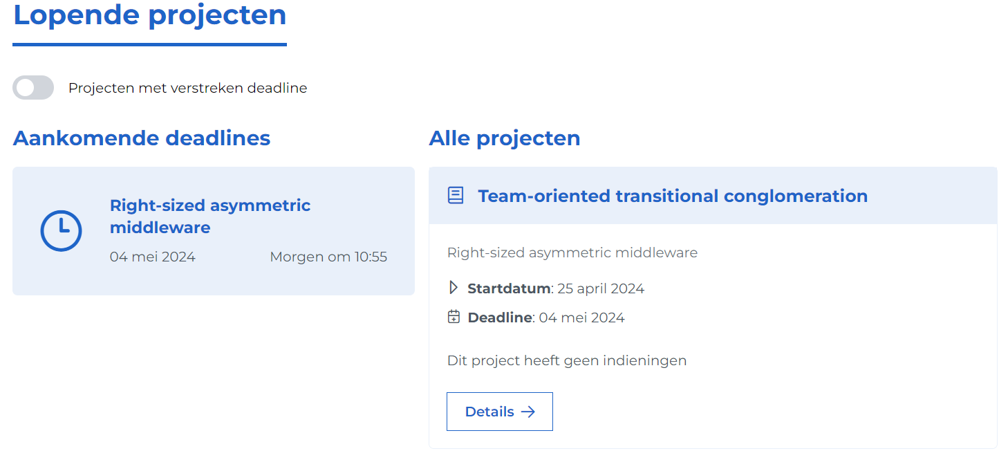
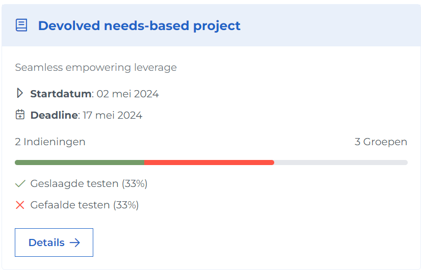

# Studenten help pagina

Deze pagina beschrijft hoe u als gebruiker met Ypovoli interagert.

## Login/Logout

**Login**

- Op de login pagina staat een knop met tekst Ugent login.

- Druk op deze knop. U wordt doorverwezen naar de inlogpagina van de Ugent.
- Selecteer het gewenste acount en volg de login stappen. U wordt doorverwezen naar het dashboard.

**Logout**

- Druk op u naam in de navigatiebalk.

## Taal veranderen

- Druk bovenaan in de navigatiebalk op het pijltje naast NL en selecteer de gewenste taal.

## Modus veranderen

::: danger Opgepast!
- Aleen mogelijk indien user meerdere is van student teacher of assistant of admin.
:::

- Druk in de navigatiebalk bovenaan op het pijltje naast de momenteel geselecteerde rol.
- Kies de niewe rol waarmee u de pagina wil bekijken.

## In/uitschrijven voor vak

    
    

**Inschrijven**

- Druk in de navigatiebalk op vakken.
- Zoek het correcte vak via de filters links op de pagina.
- Klik op de inschrijven knop bij het correcte vak.
- U bent succesvol ingeschreven voor dit vak.

**Uitschrijven**
- Optie 1:
  - Druk in de navigatiebalk op vakken.
  - Zoek het correcte vak via de filters links op de pagina.
  - Klik op de uitschrijven knop bij het correcte vak.
  - U bent succesvol uitgeschreven voor dit vak. 
  <!-- TODO is uitegschreven just ? -->
- Optie 2:
  - Ga naar de detail page.
  - Klik onderaan op de knop uitschrijven.
  - Er verschijnt een pop up.
  - Bevestig hier door op de knop uitschrijven te drukken of anuleer met de anuleer knop.

## Vak details
- Druk in de navigatiebalk op Dashboard.
- scrol naar beneden naar de "mijn vakken" sectie.
- Klik op de details knop bij het gekozen vak.

::: tip
- indien u een vak van een vorig academiejaar wilt bekijken selecteer het correcte jaar in de academiejaar selector
:::

## Projecten bekijken

- Optie 1:
  - Druk in de naviegatiebalk op Dashboard.
  - Bovenaan de pagina staat een sectie "Lopende projecten".
  ::: info
  - Hier staan links alle projecten met een deadline binnen de 7 dagen en rechts alle projecten.
  - Met de schakelknop bovenaan is er de mogelijkheid om projecten met een verstreken deadline te bekijken.
  :::
- Optie 2:
  - Druk in de navigatiebalk op "Kalender".
  - U ziet links een kalender met in een rood cirkeltje het aantal projecten u hebt elke dag indien deze er zijn.
  - Selecteer een dag met projecten en klik op het gewenste project.
- Optie 3:
  - Druk in de navigatiebalk op "Dashboard".
  - Scrol naar beneden naar de sectie "Mijn vakken".
  - Druk hier op het vak van het gezochte project.
  - Onder de sectie "Lopende projecten" ziet u alle projecten voor dit speciefieke vak.
- Optie 4: 
  - Druk in de navigatiebalk op "Projecten".
  - U ziet een overzicht van al u projecten.

::: info project kaart uitleg: 
<!-- TODO maybey ne fotoke en me numerkes aanduide -->

- Bovenaan deze kaart staat de naam van het vak waarvoor dit project uitgevaardigd is. Hieronder staat de beschrijving van het vak. De startdatum en deadline van het project staan daaronder. Hieronder staat een voortgangsbalk voor de hele klas. Links staat hoeveel indieningen de klas al heeft gedaan en rechts hoeveel groepen er zijn.
Onder deze voortgangsbalk staat de status van de tests van deze indienigen.
:::

## Lesgevers van een vak opzoeken
- Ga naar detail page van vak.
- Scrol naar de sectie "Lesgevers gelinkt aan dit vak".
- Hier vindt u een lijst van de lesgevers voor dit vak.

## Groep in/uitschrijeven

  **Inschrijven**

  
- Ga naar de detail pagina voor het gekozen project.
- Druk op de gekozen groep en druk op "Kies groep".
- U bent succesvol ingeschreven in deze groep.

**Uitschrijven**
  
- Ga naar project detail pagina.
- Druk op verlaat groep.

## indiening maken
- Ga naar project detail pagina.
- Druk op "indienen".
- Voeg de bestanden toe met de knop "Kies bestanden".
- Maak de indiening met de knop "Upload".

## status vorige indieningen bekijken:
- Ga naar indien pagina.
- Staat daar bij.

## More

Check out the documentation for the [full list of markdown extensions](https://vitepress.dev/guide/markdown).

::: info
This is an info box.
:::

::: tip
This is a tip.
:::

::: warning
This is a warning.
:::

::: danger
This is a dangerous warning.
:::

::: details
This is a details block.
:::
