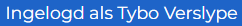
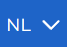
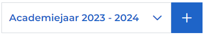
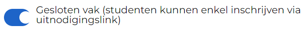
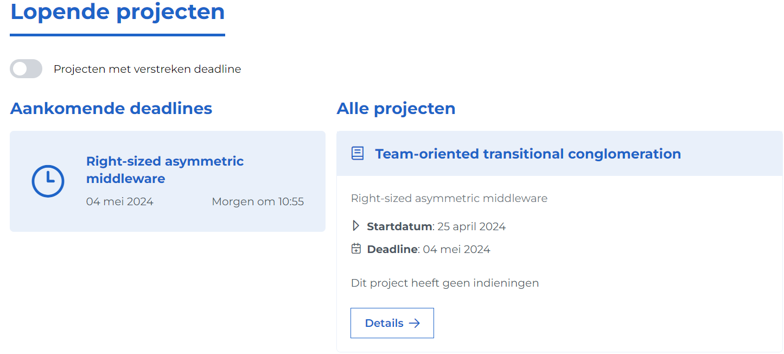
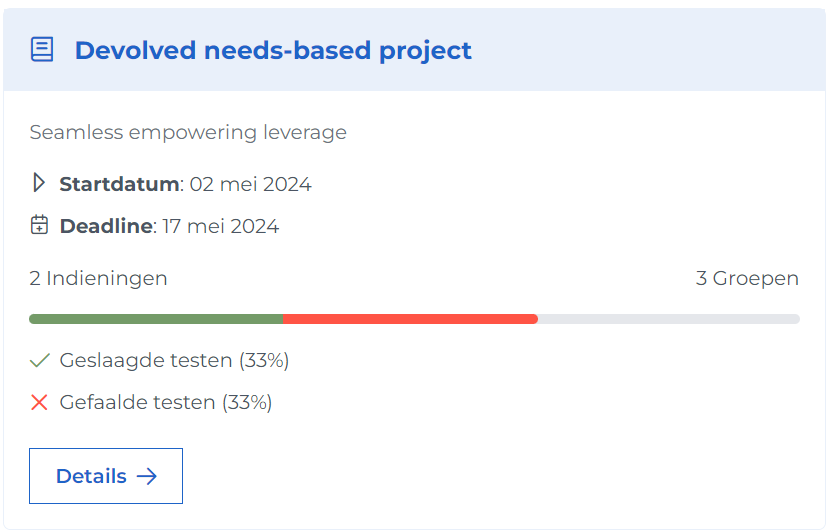

# Professor help pagina

Deze pagina beschrijft hoe u als professor met Ypovoli interageert.

## Login/Logout

**Login**

- Op de login pagina staat een knop met tekst UGent login.

- Druk op deze knop. U wordt doorverwezen naar de UGent inlogpagina.
- Selecteer het gewenste account en volg de login stappen. U wordt doorverwezen naar het dashboard.

**Logout**

- Druk op uw naam in de navigatiebalk.

## Taal veranderen

- Druk bovenaan in de navigatiebalk op het pijltje naast NL en selecteer de gewenste taal.

## Modus veranderen
::: danger Opgepast!
- Aleen mogelijk indien gebruiker meerdere van de volgende rollen heeft: student, assistent, prof of admin.
:::

- Druk in de navigatiebalk bovenaan op het pijltje naast de momenteel geselecteerde rol.
- Kies de niewe rol waarmee u de pagina wil bekijken.

## Aanmaken vak
- Druk in de navigatiebalk op Dashboard.
- Scrol naar de sectie "Mijn vakken".
- Klik op de + knop.

:::info
Wilt u u vak enkel beschikbaar plaatsen via een uitnodigingslink kan u dat via deze knop.

:::danger
- Activeer deze link via de share knop. (maximum geldigheid is 28 dagen)

    

:::

## Vak details
- Druk in de navigatiebalk op Dashboard.
- Scrol naar de sectie "Mijn vakken".
- Klik op de details knop bij het gekozen vak.

::: tip
- Indien u een vak van een vorig academiejaar wil bekijken, selecteer het correcte jaar in de academiejaar selector.
:::

## Aanmaken project

- Optie 1
    - Druk in de navigatiebalk op Dashboard.
    - Druk op "Creëer nieuw project".
- Optie 2
    - Druk in de navigatiebalk op Kalender.
    - Druk op "Creëer nieuw project".
- Optie 3
    - Ga naar detail pagina van een vak (zie [Vak details](#vak-details)).
    - Scrol naar "Lopende projecten".
    - Klik op de + knop.

## Projecten bekijken

- Optie 1:
  - Druk in de naviegatiebalk op Dashboard.
  - Bovenaan de pagina staat een sectie "Lopende projecten".
  ::: info
  - Hier staan links alle projecten met een deadline binnen de 7 dagen en rechts alle projecten.
  - Met de schakelknop bovenaan is er de mogelijkheid om projecten met een verstreken deadline te bekijken.
  :::
- Optie 2:
  - Druk in de navigatiebalk op "Kalender".
  - Op de kalender wordt, met behulp van een rode cirkel, een indicatie gegeven van het aantal deadlines op een bepaalde dag. 
  - Selecteer een dag met projecten en klik op het gewenste project.
- Optie 3:
  - Druk in de navigatiebalk op "Dashboard".
  - Scrol naar de sectie "Mijn vakken".
  - Druk hier op het vak van het gezochte project.
  - Onder de sectie "Lopende projecten" ziet u alle projecten voor dit specifieke vak.
- Optie 4: 
  - Druk in de navigatiebalk op "Projecten".
  - U ziet een overzicht van al uw projecten.

::: info Project kaart uitleg
<!-- TODO maybey ne fotoke en me numerkes aanduide -->

De kaart is als volgt ingedeeld:
- Naam van het bijhorende vak.
- Korte beschrijving van dit vak.
- Startdatum en deadline van het project.
- Balk met de voortgang van alle studenten, met hierbij het aantal indieningen en het aantal groepen.
- Status van de uitgevoerde testen voor deze indieningen.
:::

## Lesgevers van een vak opzoeken en aanpasen
- Ga naar de detail pagina van het vak (zie [Vak details](#vak-details)).
- Scrol naar de sectie "Lesgevers gelinkt aan dit vak".
- Hier vindt u een lijst van de lesgevers voor dit vak.

::: info
- Via de knop bewerken kan u lesgevers toevoegen aan (of verwijderen van) dit vak.
- Via het vuilbak icoontje kan u lesgevers verwijderen van dit vak. (enige resterende lesgever kan onmogelijk verwijderd worden)
:::